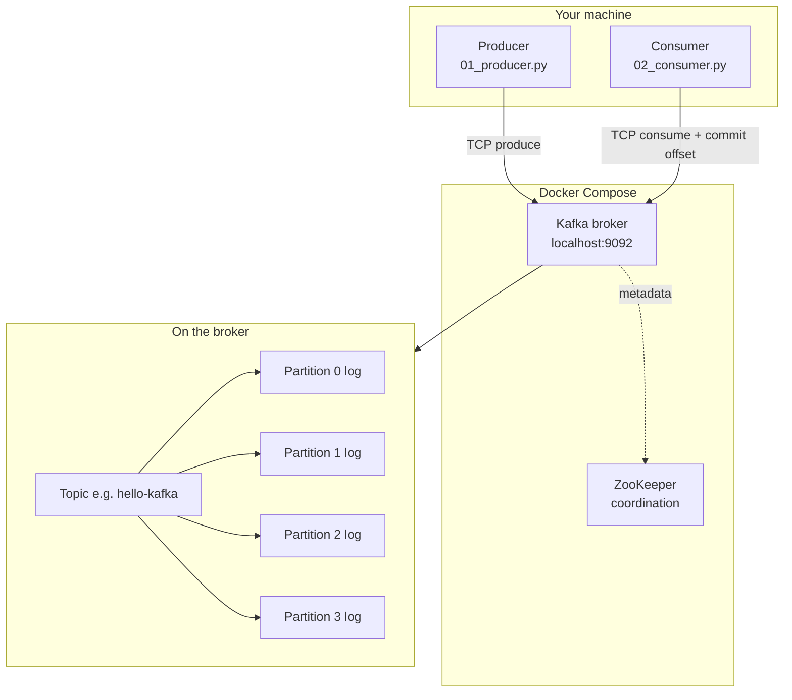
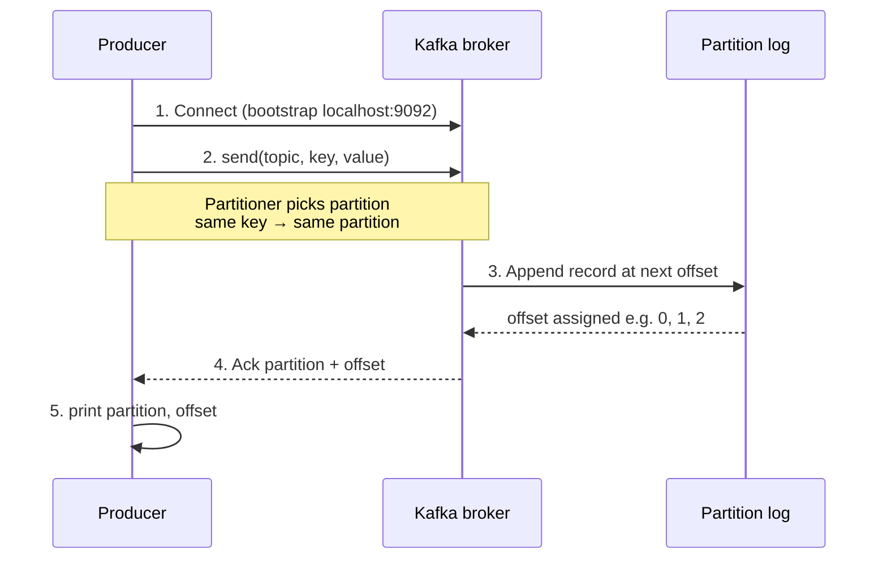
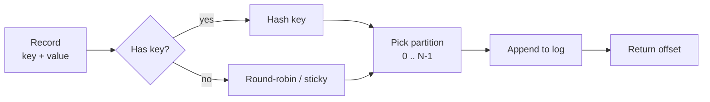
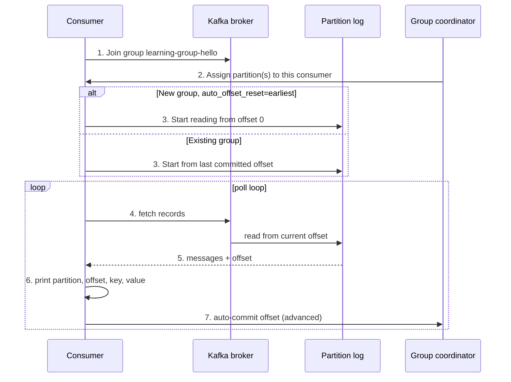
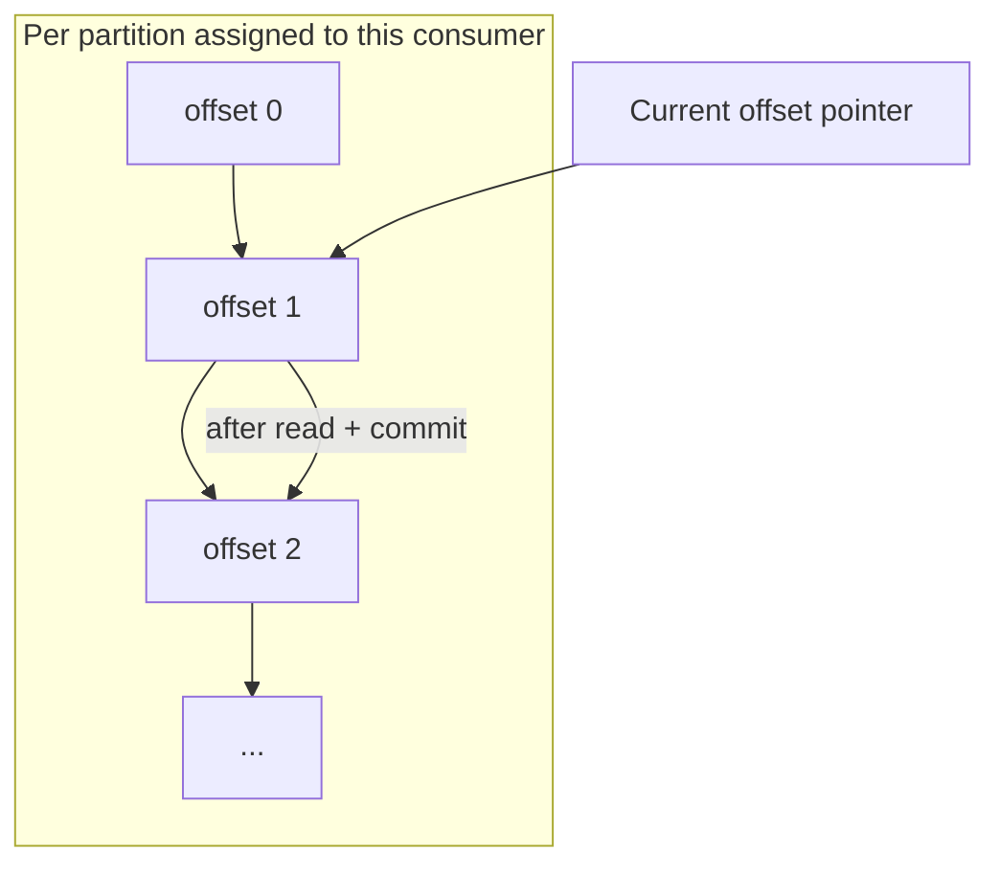
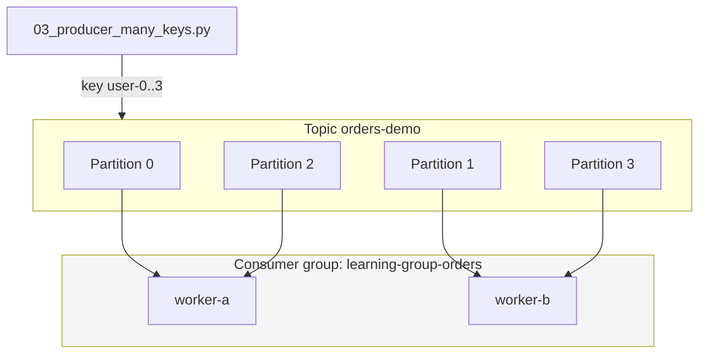
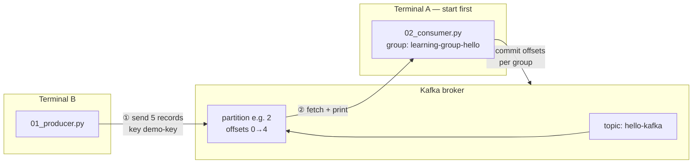

# Kafka learning lab (Python)

Hands-on **producer → topic → consumer** and **consumer group** demos with Docker and small Python scripts.

**Deeper theory and interview prep:** [docs/kafka-interview-and-core-concepts.md](docs/kafka-interview-and-core-concepts.md)

---

## What you will learn (by running the samples)

| Kafka idea | Where you see it |
|------------|------------------|
| **Topic** | Named stream (`hello-kafka`, `orders-demo` in `config.py`). |
| **Record** | One message: optional **key** + **value** (JSON in these scripts). |
| **Partition** | Shard of the topic; ordering is **per partition**, not across the whole topic. |
| **Offset** | Position of a record inside a partition (like a line number in a log). |
| **Producer** | `01_producer.py`, `03_producer_many_keys.py` — append records. |
| **Consumer** | `02_consumer.py`, `03_consumer_two_workers.py` — read records. |
| **Consumer group** | Same `group_id` → partitions are **split** among consumers (load balancing). |
| **Key → partition** | Same key → same partition (ordering for that key). |

---

## Kafka operation flow

### 1. System overview (this lab)



| Step | Who | What happens |
|------|-----|----------------|
| Connect | Producer / consumer | Client opens connection to `bootstrap_servers` (`localhost:9092`). |
| Metadata | Broker | Client learns which broker is leader for each topic partition. |
| Produce / consume | Broker | Records are appended to or read from partition logs on disk. |
| Offsets | Broker + consumer group | Kafka remembers **how far each group has read** per partition. |

---

### 2. Produce operation (write path)

What happens when you run `samples/01_producer.py`:





**In one line:** producer → broker chooses partition → record appended → you get `partition` and `offset` in the log.

---

### 3. Consume operation (read path)

What happens when you run `samples/02_consumer.py`:





**In one line:** consumer joins group → reads from its offset on each assigned partition → commits offset so restart continues where the group left off.

---

### 4. Consumer group (load balancing — Step 4)

Two workers, **same** `group_id` → partitions are **split**, not duplicated:



| Rule | Meaning |
|------|---------|
| Same `group_id` | Consumers **cooperate** — each partition goes to **one** member. |
| Different `group_id` | Separate offset tracking — **both** groups can read the **same** messages (fan-out). |
| More consumers than partitions | Extra consumers sit **idle**. |
| Same message key | Always the **same partition** (ordering per key). |

---

### 5. End-to-end flow (Samples 1 & 2)



**Run order:** start **consumer** (② waits) → run **producer** (① writes) → consumer prints (②) → offsets committed (③).

---

## What you are running locally

| Piece | Role |
|--------|------|
| **ZooKeeper** | Coordination for this broker image (common in tutorials; production clusters often use KRaft instead). |
| **Kafka broker** | Stores topics/partitions; serves producers and consumers on `localhost:9092`. |
| **Python samples** | `kafka-python` clients that print partition, offset, and key so you can map output to concepts. |

---

## Prerequisites

- [Docker Desktop](https://www.docker.com/products/docker-desktop/) — engine running before `docker compose`.
- Python 3.10+

---

## Step 1 — Start Kafka

From the repo root:

```powershell
docker compose up -d
```

Wait until services are up (first image pull can take a few minutes).

```powershell
docker compose ps
```

Auto-created topics use **4 partitions** (see `docker-compose.yml`) so the two-worker demo can split work. For a completely clean broker state:

```powershell
docker compose down -v
docker compose up -d
```

---

## Step 2 — Python environment

```powershell
python -m venv .venv
.\.venv\Scripts\Activate.ps1
pip install -r requirements.txt
```

---

## Step 3 — First producer and consumer

**Goal:** See one message travel from producer → topic → consumer, and read **partition** and **offset** in the logs.

**Start the consumer first** (it blocks and waits). Use a **new** terminal with the venv activated:

```powershell
python samples\02_consumer.py
```

You should see something like:

```text
Listening on hello-kafka ...
```

**Then run the producer:**

```powershell
python samples\01_producer.py
```

**On the producer** you will see where each record landed, for example:

```text
Sent to topic=hello-kafka partition=2 offset=0
...
```

**On the consumer** you will see the same records as they are read:

```text
partition=2 offset=0 key='demo-key' value={'seq': 0, 'message': '...'}
```

**What to notice**

- All five messages use the same key (`demo-key`) → they go to the **same partition** → offsets increase by 1 on that partition.
- Run the producer again without restarting the consumer: you only see **new** messages. The group `learning-group-hello` already committed offsets.
- To read from the beginning again: change `group_id` in `02_consumer.py` (e.g. `learning-group-hello-v2`) or wipe volumes with `docker compose down -v`.

---

## Step 4 — Two consumers, one group (load balancing)

**Goal:** Two processes share work because they share `group_id`; each partition is read by **at most one** consumer in the group.

**Terminal A** — worker 1:

```powershell
python samples\03_consumer_two_workers.py worker-a
```

**Terminal B** — worker 2:

```powershell
python samples\03_consumer_two_workers.py worker-b
```

**Terminal C** — producer with **different keys** (`user-0` … `user-3`):

```powershell
python samples\03_producer_many_keys.py
```

**What to notice**

- Each line is handled by **either** `worker-a` or `worker-b`, not both (same group).
- Messages with the same **key** always show the same **partition** (check producer output).
- With 4 partitions and 2 consumers, work is split across workers (exact assignment can vary after rebalance).
- If you only run **one** worker, it consumes **all** partitions alone.

---

## Stop Kafka

```powershell
docker compose down
```

Remove data as well:

```powershell
docker compose down -v
```

---

## Sample files

| File | Teaches |
|------|---------|
| `config.py` | Bootstrap `localhost:9092` and topic names. |
| `samples/01_producer.py` | Basic produce; fixed key → one partition. |
| `samples/02_consumer.py` | Subscribe, `group_id`, `auto_offset_reset=earliest`. |
| `samples/03_producer_many_keys.py` | Many keys → spread across partitions. |
| `samples/03_consumer_two_workers.py` | Same group, two processes, shared load. |
| `docker-compose.yml` | ZooKeeper + broker; `KAFKA_NUM_PARTITIONS: 4` for demos. |

---

## When teams choose Kafka (short)

Kafka fits **event streams** that many services read, **high throughput**, **buffering** under spikes, and **replay** (new consumer groups can read history within retention).

It is often **not** the first choice for low-traffic CRUD, strict synchronous request/response, or teams that cannot operate brokers, topics, partitions, and consumer lag.

More scenarios and interview vocabulary: [docs/kafka-interview-and-core-concepts.md](docs/kafka-interview-and-core-concepts.md).

---

## Troubleshooting

| Problem | Things to try |
|---------|----------------|
| `NoBrokersAvailable` | `docker compose ps` — is Kafka up? Wait a minute after first start. |
| Consumer shows nothing | Start consumer **before** producer; check topic name in `config.py`. |
| Producer errors on send | Broker not ready; retry after `docker compose ps` shows healthy containers. |
| Step 4: only one worker busy | Topic may have been created with 1 partition earlier — run `docker compose down -v` and `up -d` again. |
| Want to re-read all messages | New `group_id` in the consumer, or `docker compose down -v`. |
