# Kafka learning guide (Python lab)

One place for everything in this repo: **hands-on labs**, **operation flows**, **key → partition**, **consumer groups**, and **interview prep**.

---

## Table of contents

1. [Hands-on lab](#1-hands-on-lab) — setup, run samples, troubleshoot
2. [Concepts at a glance](#2-concepts-at-a-glance)
3. [Kafka operation flow](#3-kafka-operation-flow)
4. [Deep dive: Key → partition](#4-deep-dive-key--partition)
5. [Deep dive: Consumer groups](#5-deep-dive-consumer-groups)
6. [Mental model](#6-mental-model)
7. [When teams choose Kafka](#7-when-teams-choose-kafka)
8. [Interview prep](#8-interview-prep)
9. [Self-check questions](#9-self-check-questions)
10. [Sample scripts cheat sheet](#10-sample-scripts-cheat-sheet)

**Debugging tools (CLI, Kafka UI, lag checks):** [kafka-debugging-tools.md](kafka-debugging-tools.md)

---

## 1. Hands-on lab

### What you are running locally

| Piece | Role |
|--------|------|
| **ZooKeeper** | Coordination for this broker image (common in tutorials; production clusters often use KRaft instead). |
| **Kafka broker** | Stores topics/partitions; serves producers and consumers on `localhost:9092`. |
| **Python samples** | `kafka-python` clients that print partition, offset, and key so you can map output to concepts. |

### Prerequisites

- [Docker Desktop](https://www.docker.com/products/docker-desktop/) — engine running before `docker compose`.
- Python 3.10+

### Step 1 — Start Kafka

From the repo root:

```powershell
docker compose up -d
```

Wait until services are up (first image pull can take a few minutes).

```powershell
docker compose ps
```

Auto-created topics use **4 partitions** (see `docker-compose.yml`) so the two-worker demo can split work. For a completely clean broker state:

```powershell
docker compose down -v
docker compose up -d
```

### Step 2 — Python environment

```powershell
python -m venv .venv
.\.venv\Scripts\Activate.ps1
pip install -r requirements.txt
```

### Step 3 — First producer and consumer

**Goal:** See one message travel from producer → topic → consumer, and read **partition** and **offset** in the logs.

**Start the consumer first** (it blocks and waits). Use a **new** terminal with the venv activated:

```powershell
python samples\02_consumer.py
```

**Then run the producer:**

```powershell
python samples\01_producer.py
```

**On the producer** you will see where each record landed, for example:

```text
[0] APPENDED  topic='hello-kafka'  partition=2  offset=0  key='demo-key'
```

**On the consumer:**

```text
READ  partition=2  offset=0  key='demo-key'  value={'seq': 0, 'message': '...'}
```

**What to notice**

- All five messages use the same key (`demo-key`) → they go to the **same partition** → offsets increase by 1 on that partition.
- Run the producer again without restarting the consumer: you only see **new** messages. The group `learning-group-hello` already committed offsets.
- To read from the beginning again: change `group_id` in `02_consumer.py` (e.g. `learning-group-hello-v2`) or wipe volumes with `docker compose down -v`.

### Step 4 — Two consumers, one group (load balancing)

**Goal:** Two processes share work because they share `group_id`; each partition is read by **at most one** consumer in the group.

**Terminal A:**

```powershell
python samples\03_consumer_two_workers.py worker-a
```

**Terminal B:**

```powershell
python samples\03_consumer_two_workers.py worker-b
```

**Terminal C:**

```powershell
python samples\03_producer_many_keys.py
```

**What to notice**

- Each line is handled by **either** `worker-a` or `worker-b`, not both (same group).
- Messages with the same **key** always show the same **partition** (check producer output).
- With 4 partitions and 2 consumers, work is split across workers (exact assignment can vary after rebalance).
- If you only run **one** worker, it consumes **all** partitions alone.

### Stop Kafka

```powershell
docker compose down
```

Remove data as well:

```powershell
docker compose down -v
```

### Sample files

| File | Teaches |
|------|---------|
| `config.py` | Bootstrap `localhost:9092` and topic names. |
| `samples/01_producer.py` | Basic produce; fixed key → one partition. |
| `samples/02_consumer.py` | Subscribe, `group_id`, `auto_offset_reset=earliest`. |
| `samples/03_producer_many_keys.py` | Many keys → spread across partitions. |
| `samples/03_consumer_two_workers.py` | Same group, two processes, shared load. |
| `docker-compose.yml` | ZooKeeper + broker; `KAFKA_NUM_PARTITIONS: 4` for demos. |

### Troubleshooting

| Problem | Things to try |
|---------|----------------|
| `NoBrokersAvailable` | `docker compose ps` — is Kafka up? Wait a minute after first start. |
| Consumer shows nothing | Start consumer **before** producer; check topic name in `config.py`. |
| Producer errors on send | Broker not ready; retry after `docker compose ps` shows healthy containers. |
| Step 4: only one worker busy | Topic may have been created with 1 partition earlier — run `docker compose down -v` and `up -d` again. |
| Want to re-read all messages | New `group_id` in the consumer, or `docker compose down -v`. |

For inspecting topics, messages, and consumer lag: [kafka-debugging-tools.md](kafka-debugging-tools.md).

---

## 2. Concepts at a glance

| Kafka idea | Where you see it in this lab |
|------------|------------------------------|
| **Topic** | Named stream (`hello-kafka`, `orders-demo` in `config.py`). |
| **Record** | One message: optional **key** + **value** (JSON in these scripts). |
| **Partition** | Shard of the topic; ordering is **per partition**, not across the whole topic. |
| **Offset** | Position of a record inside a partition (like a line number in a log). |
| **Producer** | `01_producer.py`, `03_producer_many_keys.py` — append records. |
| **Consumer** | `02_consumer.py`, `03_consumer_two_workers.py` — read records. |
| **Consumer group** | Same `group_id` → partitions are **split** among consumers (load balancing). → [§5](#5-deep-dive-consumer-groups) |
| **Key → partition** | Same key → same partition (ordering for that key). → [§4](#4-deep-dive-key--partition) |

**One-sentence pitch (interview):** Kafka is a **distributed, durable append-only log**. Producers write **records** to **topics**; consumers read them **in order per partition**; **consumer groups** scale reads and track **offsets**.

---

## 3. Kafka operation flow

### 3.1 System overview (this lab)

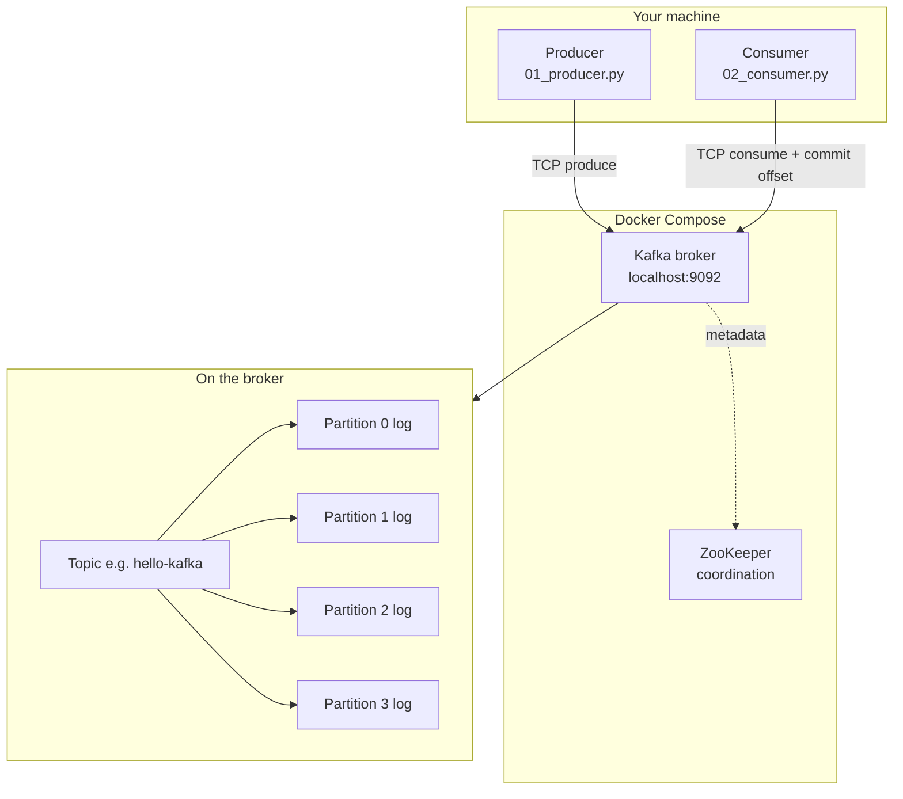

| Step | Who | What happens |
|------|-----|----------------|
| Connect | Producer / consumer | Client opens connection to `bootstrap_servers` (`localhost:9092`). |
| Metadata | Broker | Client learns which broker is leader for each topic partition. |
| Produce / consume | Broker | Records are appended to or read from partition logs on disk. |
| Offsets | Broker + consumer group | Kafka remembers **how far each group has read** per partition. |

### 3.2 Produce operation (write path)

What happens when you run `samples/01_producer.py`:

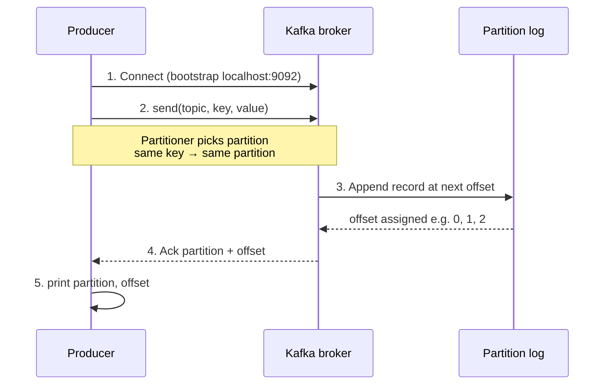

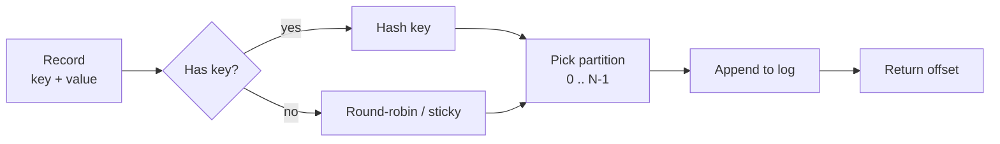

**In one line:** producer → broker chooses partition → record appended → you get `partition` and `offset` in the log.

### 3.3 Consume operation (read path)

What happens when you run `samples/02_consumer.py`:

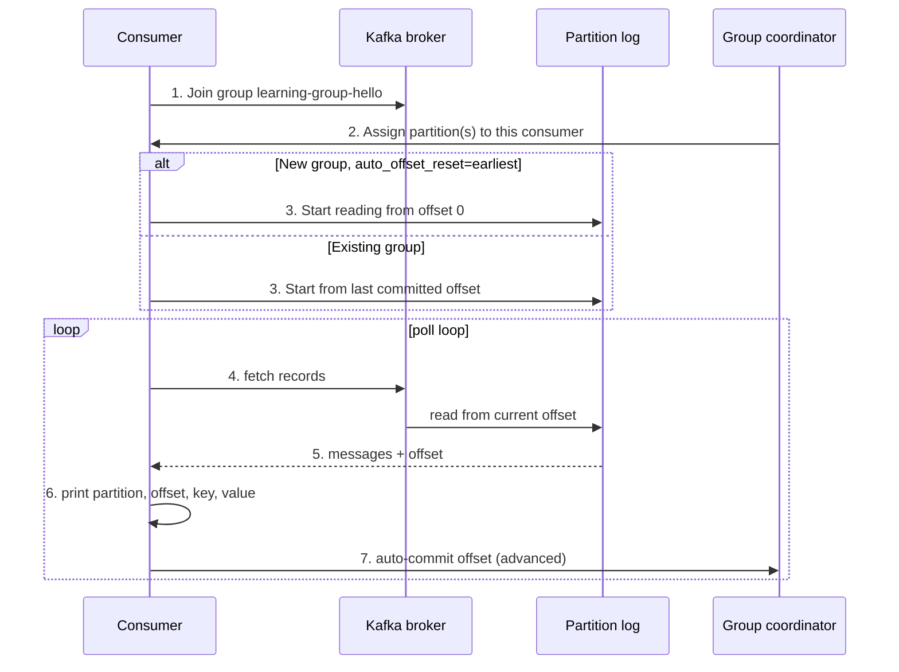

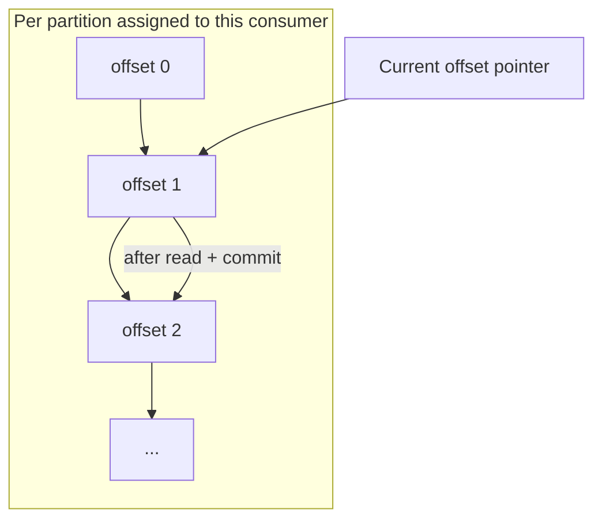

**In one line:** consumer joins group → reads from its offset on each assigned partition → commits offset so restart continues where the group left off.

### 3.4 Consumer group in the lab (Step 4)

Two workers, **same** `group_id` → partitions are **split**, not duplicated:

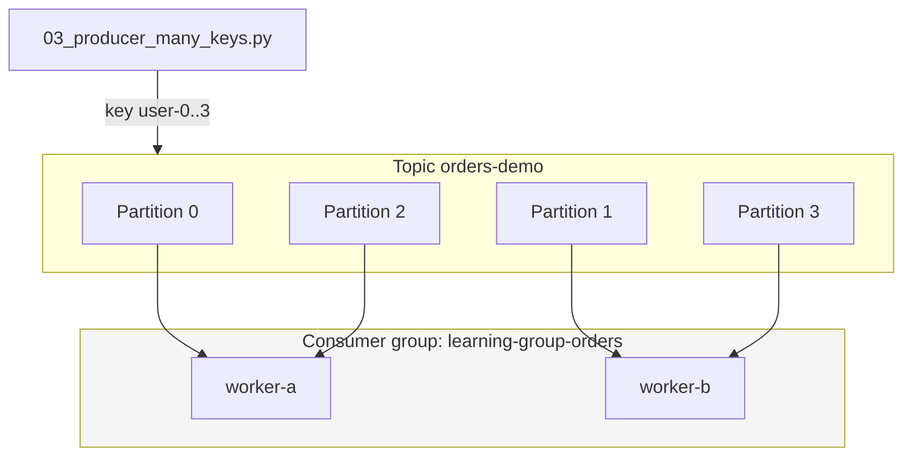

| Rule | Meaning |
|------|---------|
| Same `group_id` | Consumers **cooperate** — each partition goes to **one** member. |
| Different `group_id` | Separate offset tracking — **both** groups can read the **same** messages (fan-out). |
| More consumers than partitions | Extra consumers sit **idle**. |
| Same message key | Always the **same partition** (ordering per key). |

### 3.5 End-to-end flow (Samples 1 & 2)

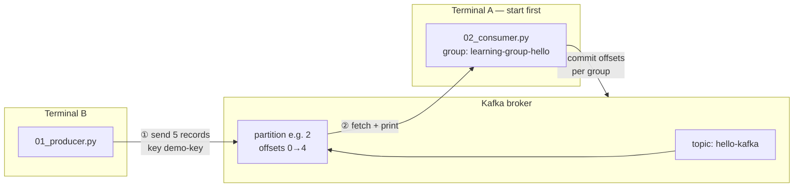

**Run order:** start **consumer** (② waits) → run **producer** (① writes) → consumer prints (②) → offsets committed (③).

---

## 4. Deep dive: Key → partition

A Kafka **record** is not just a value — it can carry an optional **key** (bytes). The key is **not** the same as an offset. It is **routing metadata** the broker uses to decide **which partition** gets the record.

### How the broker picks a partition

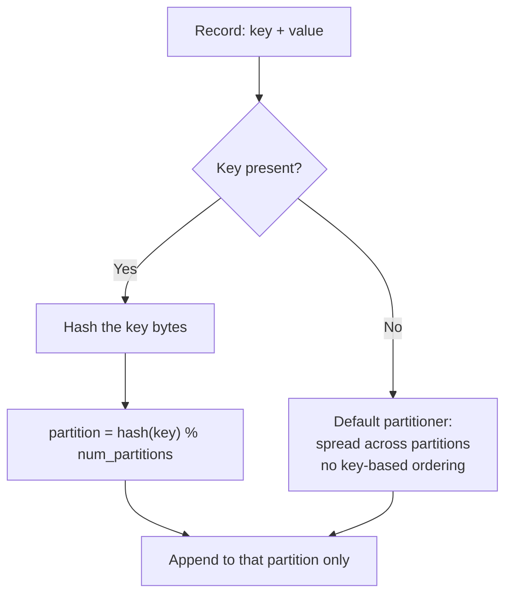

| Input | Typical result in this lab |
|-------|----------------------------|
| Key `demo-key` on every send (`01_producer.py`) | **All 5 records → one partition** → offsets 0, 1, 2, 3, 4 on that partition |
| Keys `user-0` … `user-3` (`03_producer_many_keys.py`) | **Up to 4 partitions used** — each user id sticks to one partition |
| No key | Records spread across partitions; **no** ordering guarantee by business id |

**Formula (default partitioner):** same key → same hash → same partition **as long as the topic’s partition count does not change**. If you add partitions later, key-to-partition mapping can shift for new messages (important in production).

### Why keys matter: ordering

Kafka guarantees **strict order only inside one partition**, not across the whole topic.

```text
Topic orders-demo (4 partitions)

partition 0:  user-0@offset0 → user-0@offset1 → user-0@offset2   ✓ ordered for user-0
partition 1:  user-1@offset0 → user-1@offset1                     ✓ ordered for user-1
partition 2:  ...
partition 3:  ...

Across partitions: user-0 and user-1 events can interleave in “wall clock” time — that is normal.
```

**Practical rule:** if events for `order-123` or `user-42` must be processed in order, use that id as the **key** so all its events land on one partition.

### What you see in the samples

**Sample 1** — fixed key on purpose:

```python
# samples/01_producer.py — same key every time
producer.send(TOPIC_HELLO, key="demo-key", value=payload)
```

**Sample 3** — many keys on purpose:

```python
# samples/03_producer_many_keys.py
user_id = f"user-{i % 4}"   # user-0, user-1, user-2, user-3
producer.send(TOPIC_ORDERS, key=user_id, value=payload)
```

At the end, the producer prints a **key → partition** map. Each `user-*` should map to **exactly one** partition.

### Common mistakes

| Mistake | Effect |
|---------|--------|
| Expect global order on a multi-partition topic | Events from different partitions are **not** totally ordered |
| Omit the key when order per entity matters | Same user’s events may land on different partitions |
| One dominant key (e.g. all `key="global"`) | **Hot partition** — one shard gets all traffic; parallelism drops |
| Too few distinct keys vs partitions | Some partitions stay empty; load is uneven |

### Key → partition vs consumer group

| Mechanism | Solves |
|-----------|--------|
| **Key → partition** | **Ordering** and **stickiness** — “all events for this user go to the same log” |
| **Consumer group** | **Parallelism** — “many consumers share the topic without each reading every message” |

A single consumer in a group can still read **multiple** partitions. Two records with the **same key** always go to the **same partition**, but **one worker** in the group may own that partition and process **all** keys that hash there.

---

## 5. Deep dive: Consumer groups

Every consumer belongs to a **consumer group** (`group_id` in code). Kafka uses the group to answer two questions:

1. **Who reads which partition?** (assignment / load balancing)
2. **How far has this app read?** (committed offsets **per group**, per partition)

### Mental model

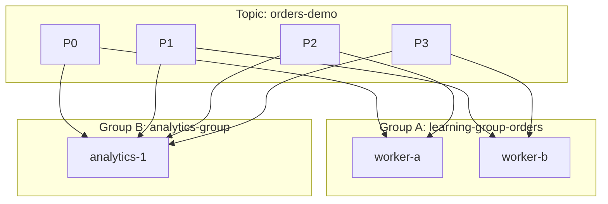

- **Group A** (`03_consumer_two_workers.py`): two workers **split** partitions — each message is handled by **one** worker.
- **Group B** (hypothetical second app with a **different** `group_id`): reads the **same** topic independently, with its **own** offsets — classic **fan-out**.

### Load balancing vs fan-out

| Pattern | `group_id` | Behavior | Use case |
|---------|------------|----------|----------|
| **Load balancing** | Same across workers | Each partition → **at most one** consumer in the group | Scale one service horizontally |
| **Fan-out** | Different per app | Each group reads **all** partitions (each with its own offsets) | Order service + analytics + audit all consume the same stream |

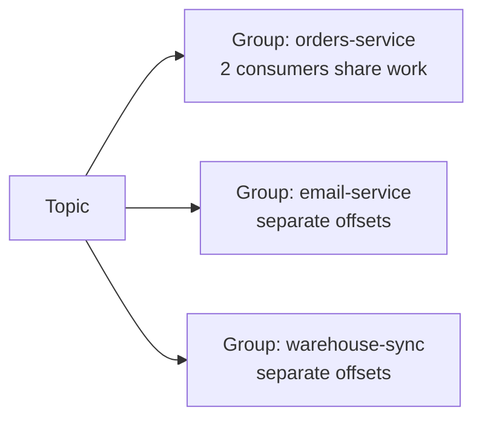

### Assignment rules (same group)

| Situation | What happens |
|-----------|----------------|
| 2 consumers, 4 partitions | Each consumer gets ~2 partitions (exact split depends on assignor) |
| 4 consumers, 4 partitions | Ideally 1 partition each |
| 5 consumers, 4 partitions | **1 consumer idle** — cannot split a partition across two consumers |
| 1 consumer, 4 partitions | That consumer reads **all** partitions alone |
| New worker joins | **Rebalance** — partitions may move to the new member; brief pause possible |
| Worker crashes / Ctrl+C | Rebalance — its partitions reassigned to survivors |

In this repo, both `worker-a` and `worker-b` use `group_id="learning-group-orders"` in `03_consumer_two_workers.py`.

### Offsets are per group (not per consumer)

Kafka stores progress as **`(group_id, topic, partition) → offset`**.

```text
learning-group-hello on hello-kafka:
  partition 2 → committed offset 5   (after Sample 1 + 2)

learning-group-hello-v2 (new group_id):
  partition 2 → no commit yet → auto_offset_reset=earliest → read from 0 again
```

| Setting in `02_consumer.py` | Meaning |
|-----------------------------|---------|
| `group_id="learning-group-hello"` | Named cursor for this app |
| `auto_offset_reset="earliest"` | If this group has **no** committed offset, start at the **oldest** retained record |
| `enable_auto_commit=True` | Periodically save offset after reads (fine for learning; production often commits after successful processing) |

### Rebalance (when membership changes)

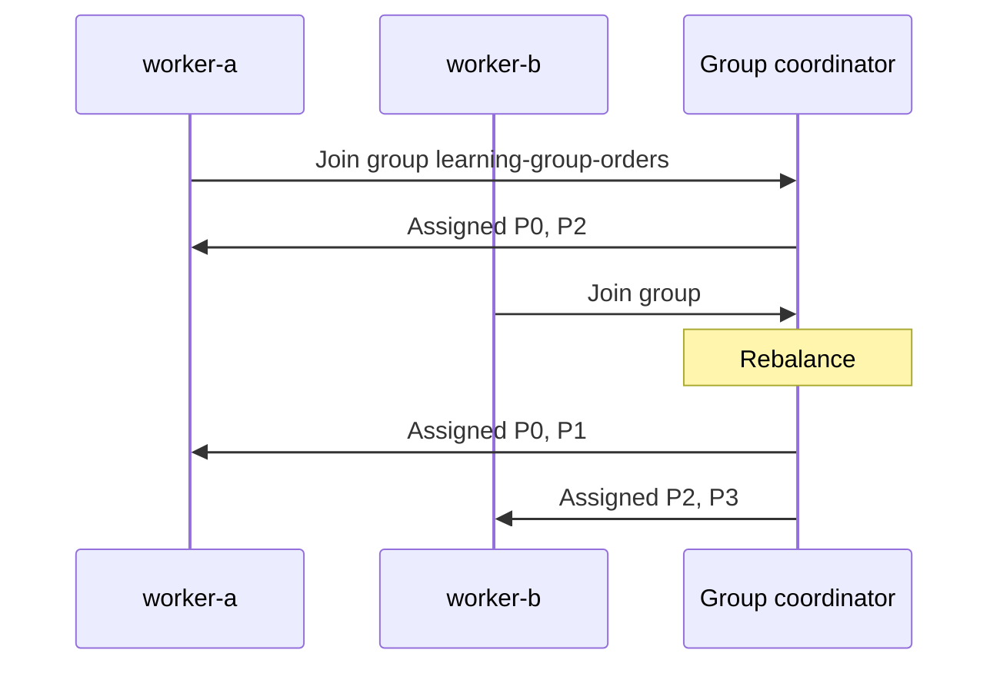

During rebalance, consumption pauses briefly. For the lab, start **both** workers before the producer so assignment stabilizes before messages arrive.

### Same group vs different group (quick check)

| Answer | Set `group_id` to |
|--------|-------------------|
| Share work (scale one service) | **Same** id on every instance |
| Independent copy of the stream (another service) | **Different** id per application |

### Lab tie-in

| Lab step | Group | Key behavior |
|----------|-------|----------------|
| Step 3 (`01` + `02`) | One consumer, `learning-group-hello` | Same key `demo-key` → one partition; one consumer reads it |
| Step 4 (`03_*`) | Two consumers, `learning-group-orders` | Four keys → up to four partitions; two workers split those partitions |

**Exercise:** Run Step 4 with only `worker-a`. Then add `worker-b` and send again with a **new** `group_id` (or `docker compose down -v`) — watch how the second worker takes partitions on rebalance.

---

## 6. Mental model

### The core object is a partition log

Imagine a **single partition** as a growing array on disk:

```text
partition 2:  [0] [1] [2] [3] ... offsets
```

Producers **append**; they do not update rows in place (normal topics). Consumers read by **offset**.

### Topics scale by splitting into partitions

- **Scale writes/reads**: many partitions → many disks/servers can work in parallel.
- **Ordering**: only **within** a partition.

### Why “replay” is natural

Because the log is retained, a new consumer group (or a reset offset in dev) can **read history** again. That is powerful for new services, debugging, and reprocessing — and it is why **disk retention policy** matters.

- **Retention by time/size**: Kafka keeps logs even if no consumer is online (unlike many queues that drop after ack).
- **Compaction** (optional): keep **latest value per key** for changelog-style topics.

### Replication (why clusters survive faults)

A partition is copied to multiple brokers. One replica is **leader** (handles reads/writes for clients); others follow. If the leader fails, a new leader is elected from **ISR** (In-Sync Replicas) when possible.

### What often confuses newcomers

1. **“Kafka guaranteed order”** — only **per partition**, not whole topic.
2. **Offsets vs keys** — offset is log position; key is routing metadata.
3. **Consumer lag** — how far behind the consumer group is from the log end; operational health signal.
4. **Rebalance** — not an error; it is coordination. It becomes a problem if it happens too often (flapping consumers, slow processing).

---

## 7. When teams choose Kafka

Kafka fits **event streams** that many services read, **high throughput**, **buffering** under spikes, and **replay** (new consumer groups can read history within retention).

**Strong fits**

- Event-driven microservices (`order-created`, `payment-completed`, …)
- Log and telemetry pipelines
- Streaming ETL / data integration
- Activity tracking (clicks, IoT)
- Asynchronous task orchestration (email, notifications, fraud checks)
- Multi-subscriber fan-out (one event, many independent consumers)

**Usually not the best first choice**

- Simple CRUD apps with low traffic
- Strict request/response needing an immediate result
- Teams with very low tolerance for broker operations (topics, partitions, retention, lag monitoring)

**Kafka vs classic message queue (e.g. RabbitMQ)** — depends on workload:

- Kafka: **log / replay**, consumer-controlled offset, high throughput, partitioned ordering, long retention.
- Classic queue: often **per-message delete** after ack, push-style patterns, different routing (exchanges).

---

## 8. Interview prep

### Vocabulary (define in under 30 seconds each)

| Term | What to say |
|------|----------------|
| **Broker** | A Kafka server that stores data and serves clients. A cluster has many brokers. |
| **Topic** | A named stream of records; logical category (like a table name, not a queue name). |
| **Partition** | A topic is split into partitions; each is an ordered, immutable log. **Parallelism and ordering live here.** |
| **Offset** | Monotonic position of a record **inside a partition** (not global across partitions). |
| **Producer** | Client that publishes to a topic (optionally with a **key**). |
| **Consumer** | Client that reads from topic(s). |
| **Consumer group** | Consumers sharing the same `group.id` cooperate: **each partition is assigned to at most one consumer in the group**. |
| **Rebalance** | When membership changes, partitions are **reassigned**. Can pause consumption briefly. |
| **Replication** | Each partition has a **leader** and **followers** on other brokers for fault tolerance. |
| **ISR** | In-Sync Replicas: followers caught up enough; used for commit rules and leader election. |

### Ordering (the answer interviewers want)

- **Global order** across a whole topic: **not guaranteed** (multiple partitions interleave).
- **Order per key**: same **key** → same **partition** → **strict order for that key** within the partition.

### Delivery semantics (trade-offs)

| Semantic | Idea | Typical cost |
|----------|------|----------------|
| **At-most-once** | Send without waiting / commit carelessly → can **lose** messages. | Lowest latency, least safety. |
| **At-least-once** | Retry on failure; consumer may **reprocess** (duplicates) unless idempotent. | Common default. |
| **Exactly-once** | Transactions / idempotent producer + careful read-process-write. | Complexity, overhead; be honest about what “EOS” covers in your stack. |

Pair semantics with **idempotent consumers** (dedupe key, natural keys, outbox pattern).

### Operational topics (mid/senior)

- **Under-replicated partitions / offline broker**: replication lag, ISR shrink, risk if leader dies.
- **Hot partition**: one key dominates → one partition bottleneck; mitigate with better key design or more partitions (does not fix a single hot key).
- **Too few partitions**: limits consumer parallelism; **too many**: more metadata, file handles, rebalance cost.
- **ZooKeeper vs KRaft**: modern direction is **KRaft** (metadata in Kafka); this lab uses ZooKeeper for simplicity.

### Project talking points

- **Schema evolution** (Avro/Protobuf/JSON Schema + Schema Registry)
- **Dead-letter** handling (retry topic, poison pill)
- **Outbox pattern** (DB + Kafka consistency)
- **Monitoring**: consumer lag, under-replicated partitions, request latencies

---

## 9. Self-check questions

Answer these out loud after running the lab:

1. What guarantees ordering, and at what scope?
2. Why might two consumers in the **same** group both stay busy but **not** read the same partition?
3. What happens if all consumers use a **new** `group_id`?
4. Why can processing be **at-least-once** even if the broker never loses data?
5. Name one cause of **hot partition** and one mitigation.

If you can explain every column in `partition=… offset=… key=…` from the terminal, you are using the right mental model.

---

## 10. Sample scripts cheat sheet

| Sample | Narrate this when you run it |
|--------|------------------------------|
| `01_producer.py` + `02_consumer.py` | **Append** to a log; **same key → same partition**; **offset** increases per partition; **group** remembers progress. |
| `03_producer_many_keys.py` | **Distinct keys** map to different partitions (see the key → partition summary). |
| `03_consumer_two_workers.py` | **Same group_id** → each partition handled by **one** worker; two terminals **split** work. |
